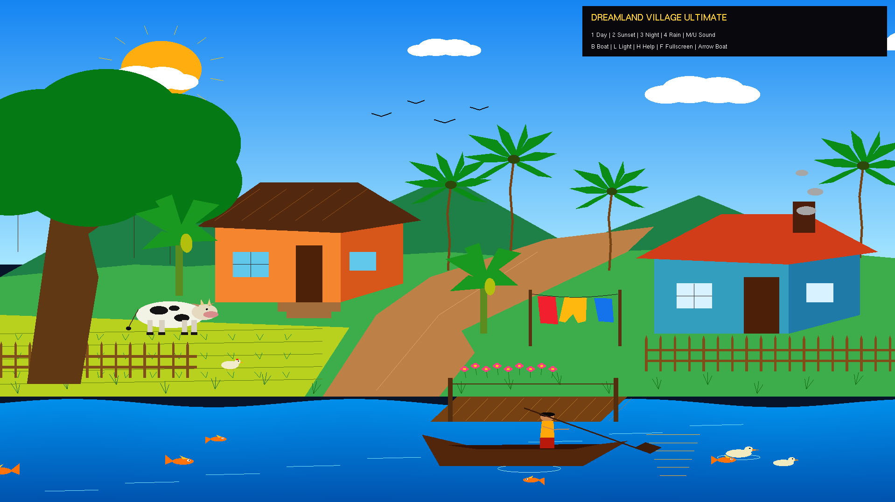
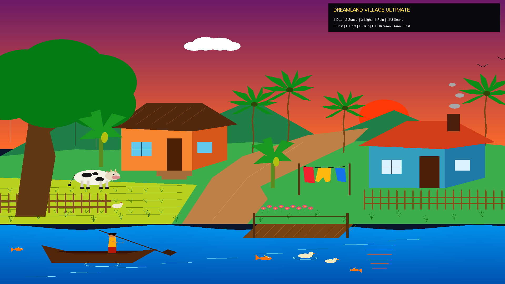
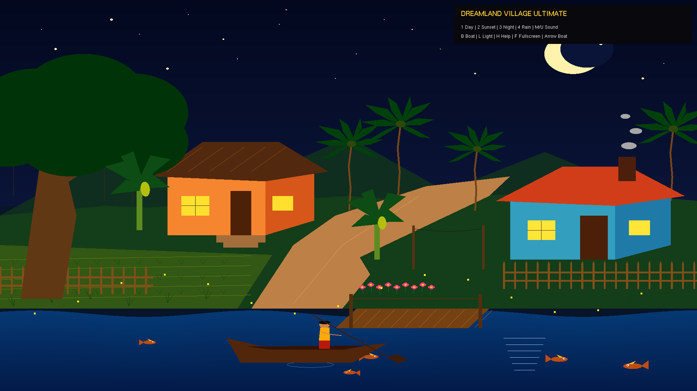
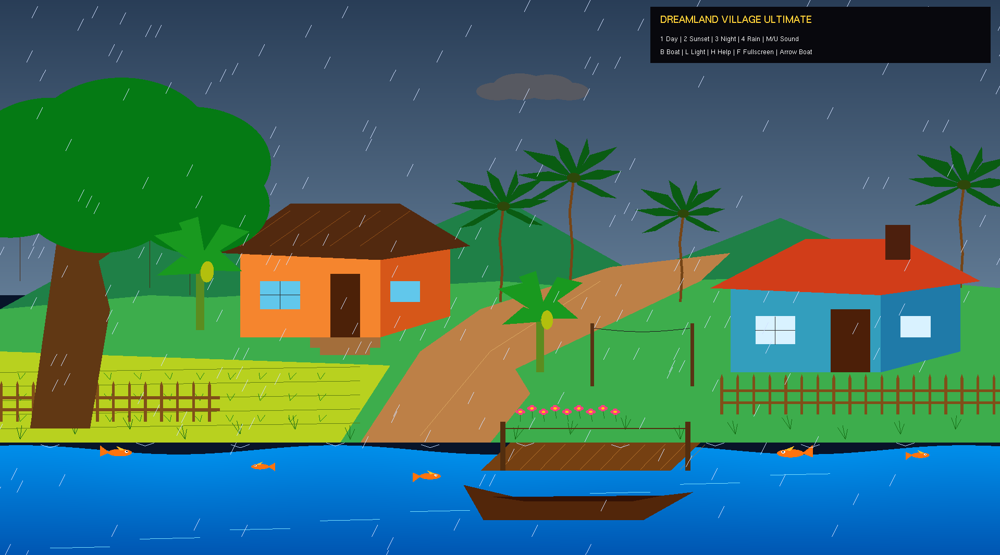

# Computer Graphics Project - Dreamland Village Ultimate

A C++ OpenGL-based computer graphics project that presents an animated village environment with multiple scene modes including **Day**, **Sunset**, **Night**, and **Rain**. The project includes interactive controls, moving objects, environmental animations, lighting effects, and scene-based sound.

## Features

- Interactive animated village environment using OpenGL/GLUT.
- Day, Sunset, Night, and Rain scene modes.
- Animated boat movement with keyboard direction control.
- Moving clouds, birds, fish, ducks, animals, smoke, clothes, grass, and water effects.
- Night scene with stars, moon, house lights, and firefly effects.
- Rain scene with rainfall and environmental effects.
- Scene-based background sound and sound controls.
- House light on/off control.
- Help panel and fullscreen mode.
- Portable OpenGL/freeglut project files included.

## Hardware & Software

- C++
- OpenGL
- GLUT / FreeGLUT
- Code::Blocks
- Windows Operating System
- OpenGL Portable Environment

## Setup Instructions

1. Open the project folder.
2. Open `openglportable-64bit/openglportable/openglportable.cbp` in Code::Blocks.
3. Make sure the included FreeGLUT/OpenGL files are available with the project.
4. Build and run the project.
5. Press **Enter** on the intro screen to start the village scene.
6. Use the keyboard controls shown in the project to switch scenes and interact with the animation.

> **Note:** The existing computer graphics project files, source code, design, audio, executable, and output have been kept unchanged. Only the screenshots were renamed and organized, and this README was added for repository presentation.

## Project Video

Watch the project demonstration video:

https://drive.google.com/file/d/1_UcEC8l-ug3ilsZQ2rCFEUmWVuPChvQw/view?usp=drive_link

## Project Screenshots

### 1. Day Scene


### 2. Sunset Scene


### 3. Night Scene


### 4. Rain Scene


## How to Use

1. Run the project and press **Enter** to start.
2. Press `1` for Day mode.
3. Press `2` for Sunset mode.
4. Press `3` for Night mode.
5. Press `4` for Rain mode.
6. Press `B` to start or stop the boat movement.
7. Press `L` to turn the house lights on or off.
8. Press `H` to show or hide the help panel.
9. Press `F` to toggle fullscreen mode.
10. Press `M` to turn sound off and `U` to turn sound on.
11. Use the Left and Right Arrow keys to control the boat direction.
12. Press `Esc` to exit the application.

Clone the repository to your local machine:

```bash
git clone https://github.com/munshi-rishad/COMPUTER_GRAPHICS_25-26.git
```
